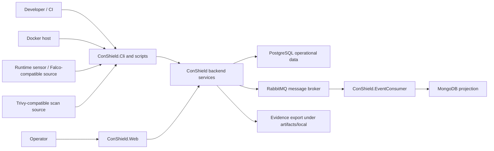
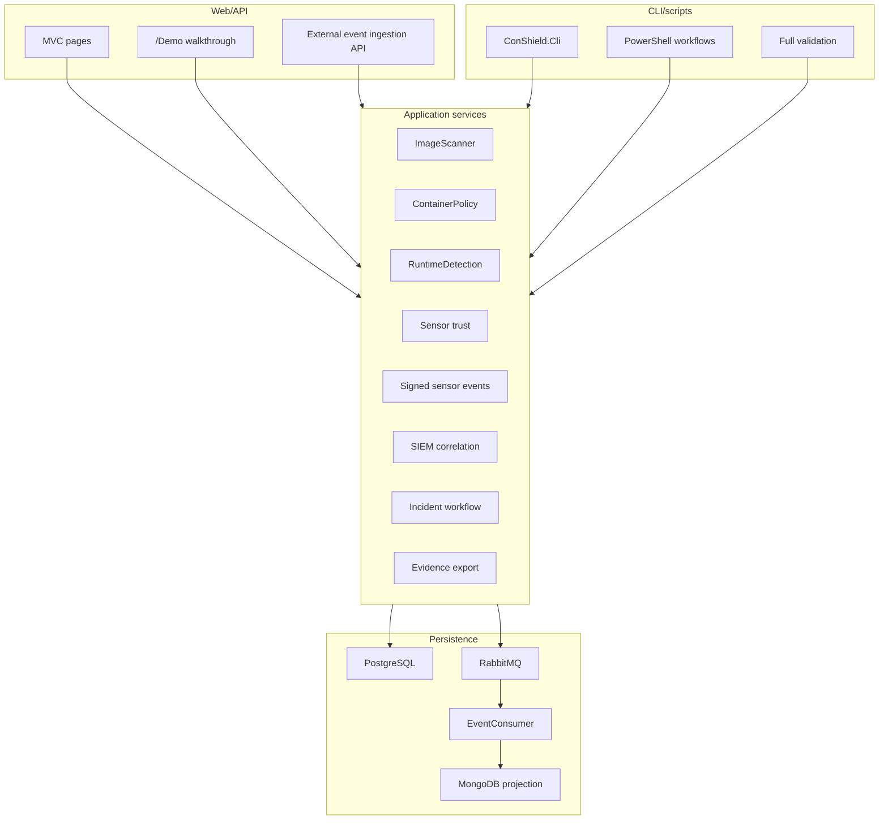
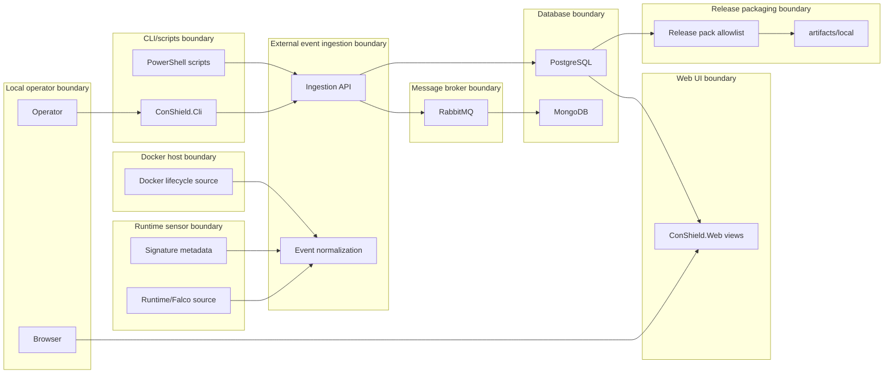
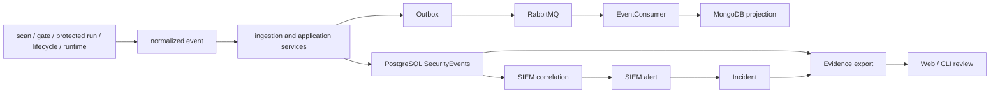
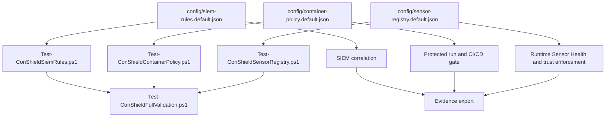

# Architecture Diagrams

This document contains Mermaid diagrams for the current ConShield local-first architecture. Diagrams are source-controlled as Markdown, not generated binary images.

## System context diagram

### Purpose

Show the main external actors and local ConShield runtime surfaces.

### Scope

Local demo and deterministic validation topology.

### Diagram

### How to read it

Developer/CI and operators interact with CLI/scripts or Web. Inputs are normalized by backend services and stored or projected through local datastores. Evidence export produces ignored local artifacts.

### Related implementation

`src/ConShield.Cli`, `src/ConShield.Web`, `src/ConShield.Application`, `src/ConShield.EventConsumer`, `scripts/Export-ConShieldDefenseEvidence.ps1`.

### Related requirements

REQ-IMG-001, REQ-CICD-001, REQ-RTE-001, REQ-SIEM-001, REQ-EVID-001, REQ-VAL-001.

## Component diagram

### Purpose

Show core internal modules and how they cooperate.

### Scope

Application modules, CLI/scripts, persistence, and optional message pipeline.

### Diagram

### How to read it

Web/API and CLI/scripts are entry points. Application services normalize and correlate data. Persistence components retain operational data and optional projections.

### Related implementation

`src/ConShield.Application`, `src/ConShield.ImageScanner`, `src/ConShield.ContainerPolicy`, `src/ConShield.RuntimeDetection`, `src/ConShield.EventPipeline`.

### Related requirements

REQ-POL-001, REQ-LIFE-001, REQ-SENS-001, REQ-SIGN-001, REQ-INC-001.

## Trust boundary diagram

### Purpose

Show where data crosses boundaries and needs validation/sanitization.

### Scope

Local operator, CLI/scripts, ingestion, broker, database, runtime sensor, Docker host, Web UI, and release packaging boundaries.

### Diagram

### How to read it

Each subgraph is a trust boundary. Inputs crossing into ConShield are normalized, validated, deduplicated, or summarized before operator display and evidence export.

### Related implementation

`docs/THREAT_MODEL.md`, external ingestion controllers, replay scripts, release packaging script, evidence exporter.

### Related requirements

REQ-EVID-001, REQ-PACK-001, REQ-SENS-001, REQ-SIGN-001, REQ-DOC-001.

## End-to-end event pipeline diagram

### Purpose

Show how scan/gate/protected run/lifecycle/runtime inputs become alerts, incidents, and evidence.

### Scope

Security event processing from source to evidence.

### Diagram

### How to read it

The primary operational path is normalized event → PostgreSQL → SIEM alert → incident → evidence. The broker/projection path is optional but validated by existing pipeline contracts.

### Related implementation

`ConShield.SecurityEvents`, `ConShield.EventPipeline`, `ConShield.EventConsumer`, SIEM correlation service, incident services.

### Related requirements

REQ-IMG-001, REQ-SIEM-001, REQ-INC-001, REQ-EVID-001.

## Configuration-as-code diagram

### Purpose

Show committed default configs and how validation/runtime paths use them.

### Scope

SIEM rules, container policy, sensor registry, validation, CLI/Web/evidence.

### Diagram

### How to read it

Committed default configs are validated directly and also consumed by runtime/demo workflows. Local overrides are intentionally ignored by Git.

### Related implementation

`config/*.default.json`, validation scripts, `ConShield.Cli validate`, evidence exporter.

### Related requirements

REQ-POL-001, REQ-SIEM-001, REQ-SENS-001, REQ-VAL-001.
