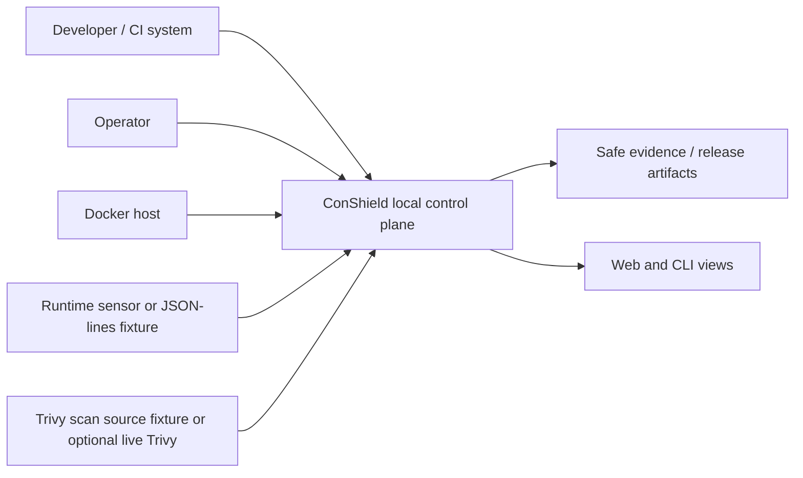
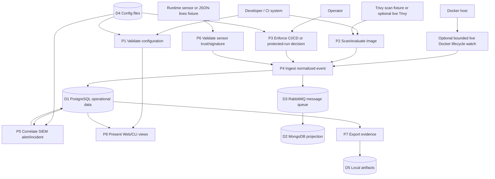
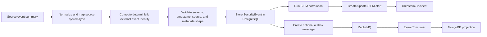
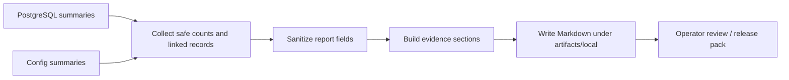

# Data Flow Model

## Scope

This data flow model describes the local ConShield security event processing and evidence export flows. It is intended for architecture review and diploma defense, not as a claim of production deployment coverage.

## Data stores

| ID | Store | Purpose |
|---|---|---|
| D1 | PostgreSQL operational data | Security events, SIEM alerts, incidents, sensors, outbox/inbox, app state. |
| D2 | MongoDB projection | Optional projection/checkpoint view for message-consumer workflows. |
| D3 | RabbitMQ message queue | Optional event delivery between outbox and EventConsumer. |
| D4 | Config files | SIEM rules, container policy, sensor registry defaults. |
| D5 | Local artifacts | Ignored generated evidence, gate reports, and release packs. |

## External entities

- Developer / CI system.
- Operator.
- Docker host.
- Runtime sensor or deterministic JSON-lines stream fixture.
- Trivy scan source: deterministic fixture or optional manual live Trivy scan/gate.

## Processes

| ID | Process |
|---|---|
| P1 | Validate configuration. |
| P2 | Scan/evaluate image. |
| P3 | Enforce CI/CD or protected-run decision. |
| P4 | Ingest normalized event. |
| P5 | Correlate SIEM alert/incident. |
| P6 | Validate sensor trust/signature. |
| P7 | Export evidence. |
| P8 | Present Web/CLI views. |

## Data flows

- Scan fixture or scan result → P2 → normalized IMG event.
- Container policy config → P3 → POL/LIFE launch decision event.
- Docker lifecycle fixture or optional bounded live Docker watch → P4 → sanitized LIFE event.
- Runtime/Falco fixture or JSON-lines stream → P6/P4 → RTE/SENSOR/SIGN event.
- P4 → D1 and optionally D3 → EventConsumer → D2.
- D1 + D4 → P5 → alerts/incidents.
- D1 + alert/incident summaries → P7 → D5.
- D1 + safe summaries → P8 → Web/CLI.

Data flows intentionally avoid secret values and sensitive payload bodies in docs, UI summaries, release packages, and generated evidence.

## DFD Level 0 — Context

## DFD Level 1 — Main processing

## DFD Level 2 — Security event processing

## DFD Level 2 — Evidence export

## Sensitive data handling

- Secrets, connection strings, tokens, cookies, local overrides, and environment values stay outside committed docs and generated release packs.
- Evidence export uses summaries and linked IDs rather than sensitive payload bodies.
- Release packaging is allowlist-based and excludes local/generated material.
- README and docs link to generated artifact locations but do not commit generated files.

## Sanitization rules

- Prefer counts, IDs, statuses, rule IDs, source systems, timestamps, and high-level summaries.
- Do not include secret values, local credentials, payload bodies, logs, screenshots, or generated local artifacts in Git.
- Keep reports under ignored `artifacts/local/` unless a sanitized template is explicitly committed.

## Traceability to requirements

- REQ-IMG-001 maps to P2/P4.
- REQ-POL-001 and REQ-CICD-001 map to P3.
- REQ-LIFE-001 and REQ-RTE-001 map to P4/P6.
- REQ-SENS-001, REQ-SENS-002, and REQ-SIGN-001 map to P6.
- REQ-SIEM-001 and REQ-INC-001 map to P5.
- REQ-EVID-001 maps to P7.
- REQ-VAL-001 maps to P1 and full validation.
- REQ-PACK-001 maps to D5 release packaging controls.
