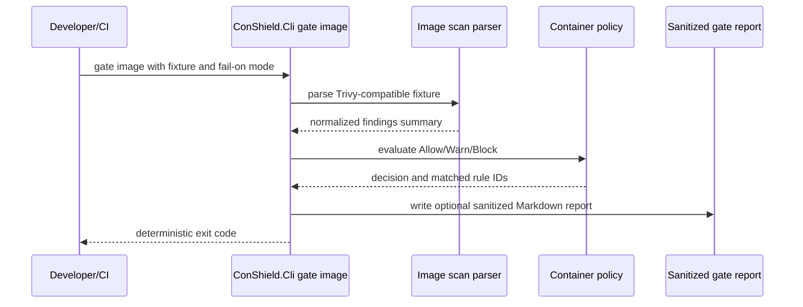
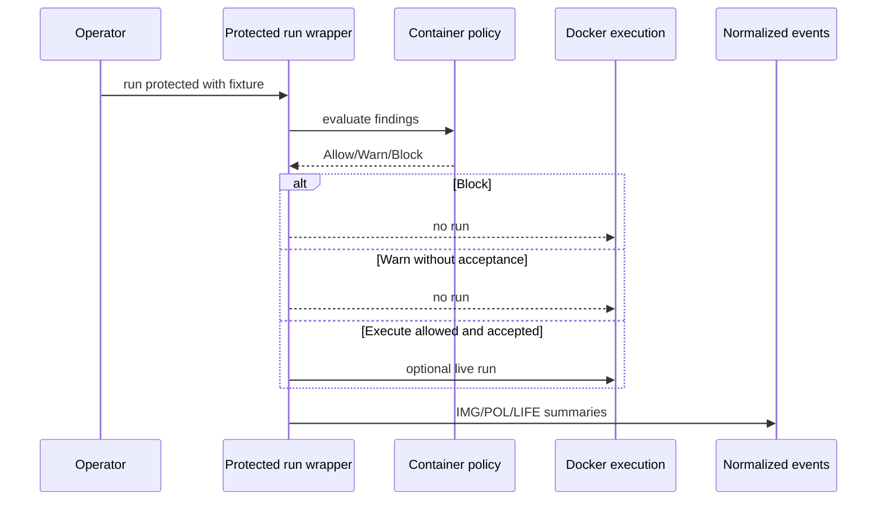
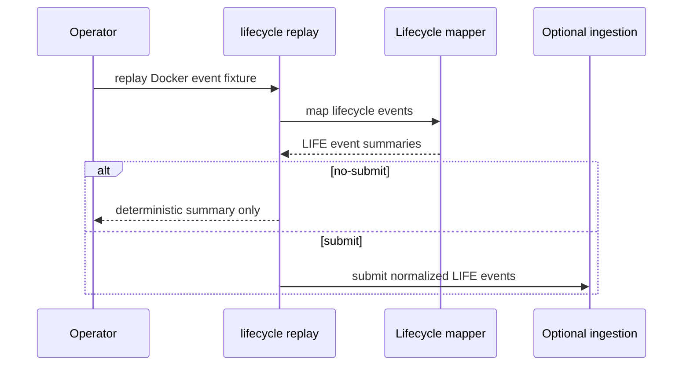
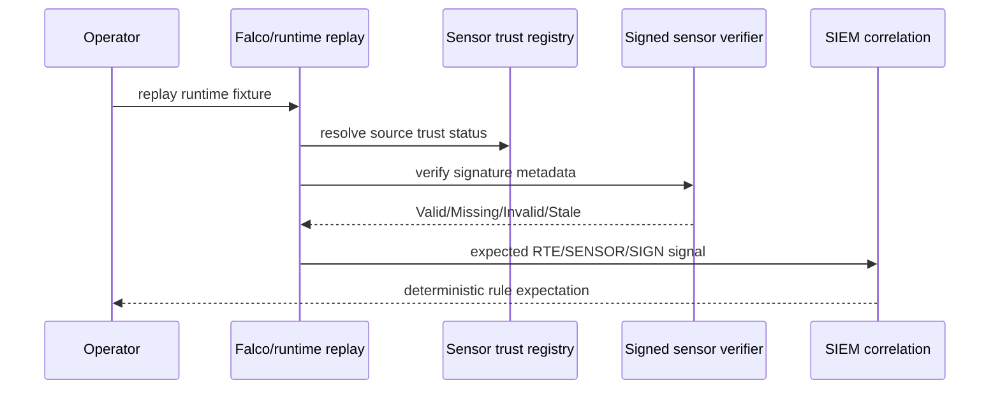
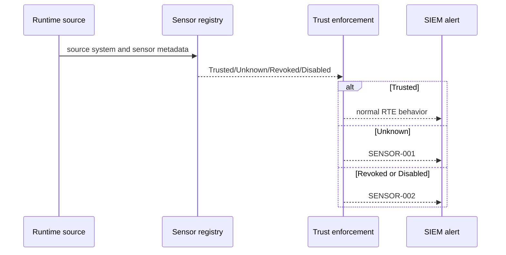
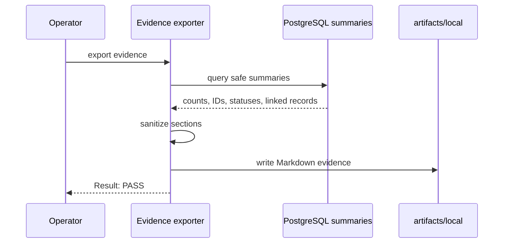
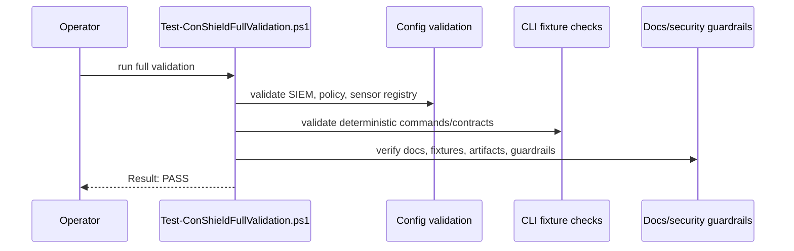

# Sequence Flows

This document shows key local ConShield sequences using Mermaid. The flows are deterministic by default and avoid external internet, live Docker execution, live Trivy DB/network, real Fedora/Falco, real certificates, private keys, signing keys, or real secrets.

## CI/CD gate sequence

## Protected run sequence

## Docker lifecycle replay sequence

## Runtime sensor signed event sequence

## Sensor trust enforcement sequence

## Evidence export sequence

## Full validation sequence

